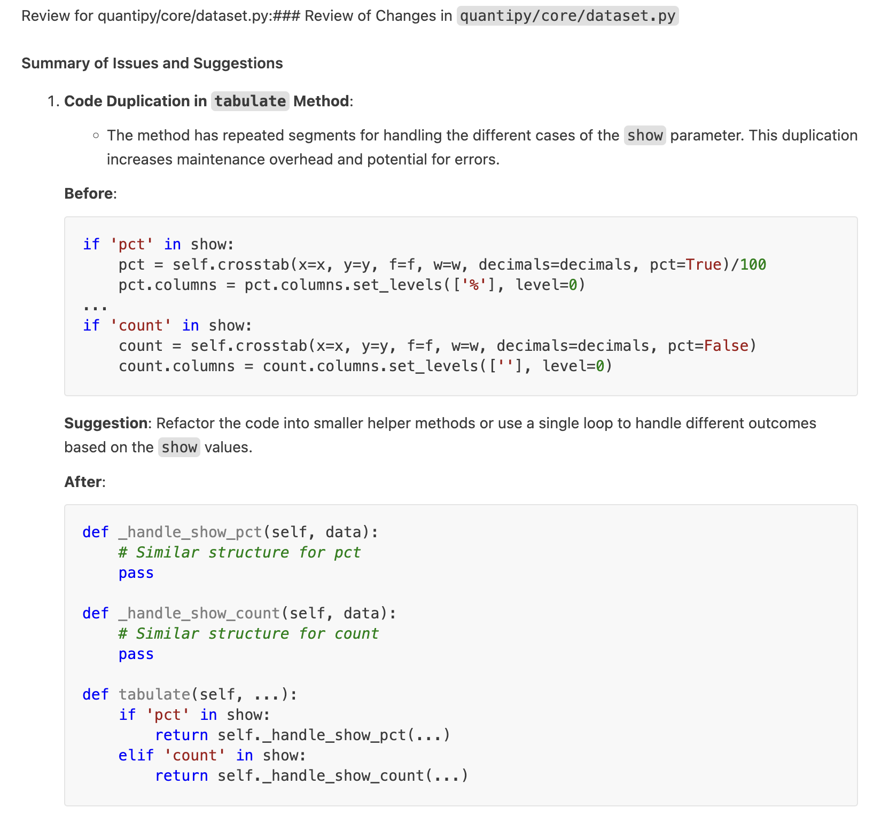

# LLM Code Review

## Overview

`llm-code-review` is a command-line tool for automated code reviews of GitHub pull requests using OpenAI's GPT models or local models via Ollama. It fetches modified files, extracts diffs, retrieves full file contents for context, and generates concise, constructive code reviews.

## Features
- Supports OpenAI API (`gpt-4o-mini`, etc.)
- Supports local models via Ollama
- Fetches diffs from GitHub pull requests
- Retrieves full file contents for context
- Provides AI-generated feedback with before/after code snippets
- Filters reviews to focus only on Python files

## Installation

Install the package from PyPI:
```sh
pip install llm-code-review
```

## Usage

### Basic Command

To review a GitHub pull request:
```sh
llm-code-review owner/repository PR_NUMBER
```

Example:
```sh
llm-code-review octocat/hello-world 42
```

Note that this defaults to OpenAI's `gpt-4o-mini` and you have to top up your credit to use it. If you don't want to spend money, download Ollama and use a local model for your code reviews (see below).

### Using a Specific Model

#### OpenAI
```sh
llm-code-review octocat/hello-world 42 --model openai:gpt-4o-mini
```

#### Ollama (local model)
```sh
llm-code-review octocat/Hello-World 42 --model ollama:deepseek-r1:8b
```
This command fetches the pull request #42 from the `octocat/Hello-World` repository, retrieves modified Python files, and reviews the changes using OpenAI.


## Prerequisites
Before using the tool, you must set up the required API keys as environment variables:

- **GitHub Token**: To authenticate API requests, create a GitHub personal access token (with `repo` scope for private repositories) and set it as an environment variable.
- **OpenAI API Key**: Obtain an API key from OpenAI and set it as an environment variable.

### Setting Up Environment Variables

#### Option 1: Manually Set in Shell Profile
Add the following lines to your shell profile (e.g., `~/.bashrc`, `~/.zshrc`):

```sh
export GITHUB_TOKEN="your_github_token"
export OPENAI_API_KEY="your_openai_api_key"
```

Then, reload your shell profile:

```sh
source ~/.bashrc  # or source ~/.zshrc
```

#### Option 2: Use a `.env` File with `direnv`
If you prefer to keep your API keys separate from your shell profile, you can use `direnv` to automatically load environment variables when you enter a project directory.

1. Install `direnv`:
   ```sh
   sudo apt install direnv  # Ubuntu/Debian
   brew install direnv      # macOS
   ```

2. Enable `direnv` in your shell:
   ```sh
   echo 'eval "$(direnv hook bash)"' >> ~/.bashrc  # For Bash
   echo 'eval "$(direnv hook zsh)"' >> ~/.zshrc    # For Zsh
   source ~/.bashrc  # or source ~/.zshrc
   ```

3. Create a `.envrc` file in your project directory:
   ```sh
   echo 'export GITHUB_TOKEN="your_github_token"' > .envrc
   echo 'export OPENAI_API_KEY="your_openai_api_key"' >> .envrc
   ```

4. Allow `direnv` to load the file:
   ```sh
   direnv allow
   ```

Now, every time you enter the project directory, your API keys will be automatically loaded.

## How It Works
1. Fetches pull request details from GitHub.
2. Retrieves the full content of modified Python files.
3. Sends the diff and full file content to OpenAI for review.
4. Displays feedback, focusing on potential improvements and critical issues.

## Notes
- Only Python (`.py`) files are reviewed.
- The review focuses on changes in the PR while using the full file context.
- If a file has more than three issues, only the most important one is highlighted unless critical issues are found.

## Example output




## License
MIT License

## Contributions
Feel free to open issues or submit pull requests!

Author: Geir Freysson

